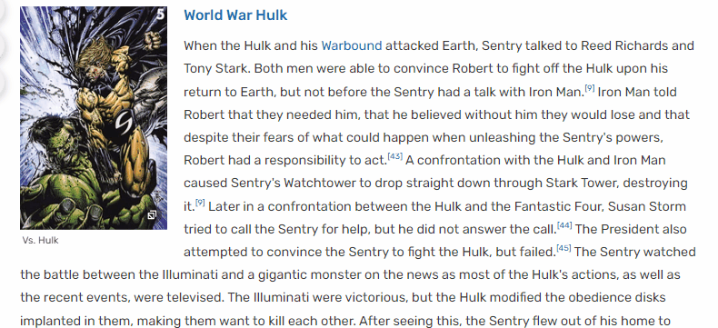
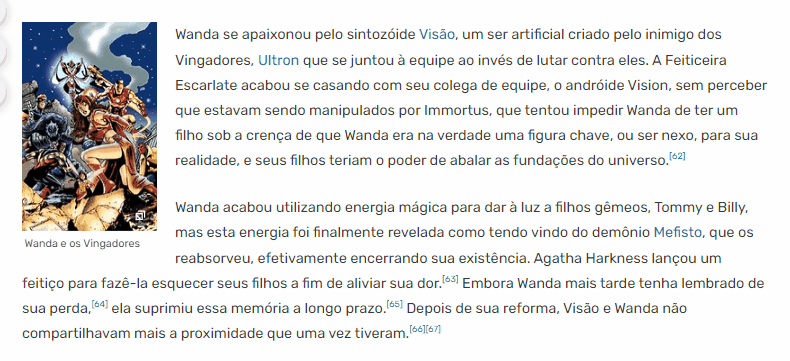

# Projeto herois mais fortes da marvel

Olá! Neste projeto, listo os heróis mais fortes da Marvel com base em seus poderes, habilidades especiais e manipulações graduais.

No momento, apenas dois heróis estão listados (os menos fortes da seleção). Então, vamos lá!

## Sentry 

O primeiro personagem é o Sentry, também conhecido como Sentinela. No gif abaixo, você pode conferir um pouco mais sobre o personagem:

)

Este personagem é um dos meus favoritos e, com certeza, vale a pena dar uma olhada nele no site da Marvel Wiki.

## Feitiçeira Escarlate

A próxima personagem é a tão querida pelos fãs, Feiticeira Escarlate. Abaixo você pode conferir brevemente mais sobre ela:

)

### Mais sobre o projeto

O objetivo deste projeto é destacar alguns dos heróis mais fortes. No entanto, isso não significa que um personagem não listado aqui não mereça estar na seleção.

Esta lista é focada em heróis incrivelmente poderosos, mas ainda "pé no chão". Ou seja, não inclui entidades cósmicas ou personagens que transcendem a cosmologia da Marvel.

Obrigado pela atenção e aproveite o projeto! 😊